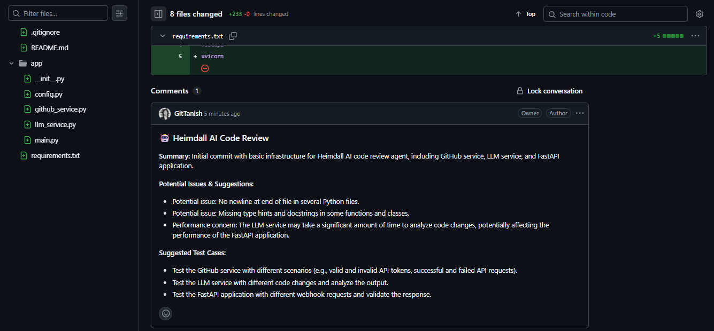

# Heimdall 🤖

**The All-Seeing AI Code Guardian**

Heimdall is an intelligent code review agent that automatically analyzes your GitHub commits and provides comprehensive feedback through AI-powered reviews. Named after the Norse god who watches over the rainbow bridge, Heimdall vigilantly guards your codebase by detecting potential issues, suggesting improvements, and ensuring code quality.

## Features

🔍 **Automated Code Analysis** – Automatically reviews every commit pushed to your repository  
🧠 **AI-Powered Reviews** – Leverages Groq's Llama 3 70B model for intelligent code analysis  
📝 **Comprehensive Feedback** – Provides summaries, issue detection, documentation drafts, and test suggestions  
⚡ **Real-time Integration** – Responds immediately to GitHub webhook events  
🔧 **Easy Setup** – Simple configuration with environment variables

## Tech Stack


- **Backend**: FastAPI (Python web framework)
- **AI/LLM**: Groq API with Llama 3 70B model
- **GitHub Integration**: GitHub REST API v3
- **HTTP Client**: Requests library
- **Environment Management**: python-dotenv

## Demo

Here's Heimdall in action — automatically reviewing a commit and posting structured AI feedback directly on GitHub:

  

## How It Works

1. **Webhook Trigger**: GitHub sends a webhook when code is pushed to your repository
2. **Diff Retrieval**: Heimdall fetches the commit diff using GitHub's API
3. **AI Analysis**: The code changes are analyzed by Groq's Llama 3 70B model
4. **Review Generation**: AI generates a structured review with actionable insights
5. **Comment Posting**: Review is automatically posted as a comment on the commit

## Review Components

Each Heimdall review includes:

- **Summary**: Executive overview of the changes
- **Potential Issues**: Bugs, style violations, performance concerns, security issues
- **Documentation**: Auto-generated docs for new functions and classes
- **Test Suggestions**: Recommended unit tests to validate the changes

## Quick Start

### Prerequisites

- Python 3.8+
- GitHub repository with webhook access
- Groq API account

### Installation

1. **Clone the repository**
   ```bash
   git clone https://github.com/GitTanish/Heimdall.git
   cd Heimdall
   ```

2. **Install dependencies**
   ```bash
   pip install fastapi uvicorn requests groq python-dotenv
   ```

3. **Configure environment variables**
   Create a `.env` file in the root directory:
   ```env
   GROQ_API_KEY=your_groq_api_key_here
   GITHUB_TOKEN=your_github_personal_access_token
   ```

4. **Run the application**
   - Local development:
     ```bash
     uvicorn app.main:app --reload
     ```
   - Production deployment:
     ```bash
     uvicorn app.main:app --host 0.0.0.0 --port 8000
     ```

### GitHub Webhook Setup

1. Go to your GitHub repository settings
2. Navigate to **Webhooks** → **Add webhook**
3. Set the Payload URL to your Heimdall instance:
   - Local development (with [ngrok](https://ngrok.com/)):
     ```bash
     ngrok http 8000
     ```
     Use the generated `https://xxxx.ngrok-free.app/webhook/github` as the Payload URL
   - Production: `https://yourdomain.com/webhook/github`
4. Select **Content type**: `application/json`
5. Choose **Just the push event**
6. Save the webhook

## API Endpoints

### `GET /`
Health check endpoint to verify Heimdall is running.

**Response:**
```json
{
  "status": "Heimdall AI Agent is running!"
}
```

### `POST /webhook/github`
Webhook endpoint for GitHub push events. Processes commits and posts AI-generated reviews.

**Expected Payload:** GitHub push event webhook payload

**Response:**
```json
{
  "status": "success",
  "message": "Review posted for commit abc123..."
}
```

## Configuration

### Environment Variables

| Variable | Description | Required |
|----------|-------------|----------|
| `GROQ_API_KEY` | Your Groq API key for LLM access | Yes |
| `GITHUB_TOKEN` | GitHub Personal Access Token with repo permissions | Yes |

### GitHub Token Permissions

For **classic Personal Access Tokens**:
- `repo` (Full control of private repositories)

For **fine-grained tokens**:
- **Contents** → Read and write

## Architecture

```
┌─────────────────┐    ┌──────────────┐    ┌─────────────┐
│   GitHub Repo   │───▶│   Heimdall   │───▶│    Groq     │
│   (Webhook)     │    │   FastAPI    │    │   LLM API   │
└─────────────────┘    └──────────────┘    └─────────────┘
                              │
                              ▼
                       ┌──────────────┐
                       │   GitHub     │
                       │   Comments   │
                       └──────────────┘
```

## Deployment

### Using Docker (Recommended)

```dockerfile
FROM python:3.9-slim

WORKDIR /app
COPY requirements.txt .
RUN pip install -r requirements.txt

COPY . .
EXPOSE 8000

CMD ["uvicorn", "app.main:app", "--host", "0.0.0.0", "--port", "8000"]
```

### Using Cloud Platforms

Heimdall can be deployed on:
- **Heroku**: Use the included `Procfile`
- **Railway**: Direct GitHub integration
- **DigitalOcean App Platform**: Single-click deployment
- **AWS Lambda**: With FastAPI adapter
- **Google Cloud Run**: Container deployment

## Example Review Output

```markdown
### 🤖 Heimdall AI Code Review

**Summary:** Added user authentication middleware with JWT token validation.

**Potential Issues & Suggestions:**
- Consider adding rate limiting to prevent brute force attacks
- The JWT secret should be loaded from environment variables
- Missing error handling for expired tokens

**Documentation Draft:**
```markdown
## authenticate_user(token: str) -> User | None
Validates JWT token and returns authenticated user object.
```

**Suggested Test Cases:**
- Test valid JWT token authentication
- Test expired token rejection
- Test malformed token handling
- Test missing token scenario
```

## Contributing

We welcome contributions! Please see our [Contributing Guide](CONTRIBUTING.md) for details.

1. Fork the repository
2. Create a feature branch
3. Make your changes
4. Add tests if applicable
5. Submit a pull request

## Troubleshooting

### Common Issues

**Webhook not triggering:**
- Verify the webhook URL is accessible from GitHub
- Check that the endpoint returns 200 status
- Ensure the webhook is configured for push events

**API errors:**
- Verify your Groq API key is valid and has credits
- Check your GitHub token has the required permissions
- Review the application logs for detailed error messages

**Comments not posting:**
- Ensure the GitHub token has write permissions
- Verify the repository owner/name in the webhook payload
- Check for network connectivity issues

## License

This project is licensed under the [MIT License](LICENSE).

## Acknowledgments

- Named after Heimdall, the all-seeing guardian of Norse mythology
- Powered by [Groq](https://groq.com/) for lightning-fast AI inference
- Built with [FastAPI](https://fastapi.tiangolo.com/) for robust webhook handling

---

**"I can see all the way to the end of the rainbow bridge... and your code bugs too."** 🌈👁️